# Sunshine Galaxy College (S.G College)

A Django-based college website mini project developed for academic purposes using the Python Django Web Development Framework.

---

## 1. Project Title

**Sunshine Galaxy College (S.G College)**

---

## 2. Reference Website

The project was developed by taking inspiration from the structure and presentation of a college website:

**Reference Website:** https://siesascs.edu.in/

The reference website was used for understanding the general structure and presentation of a college website. The implementation, content, database design, and Django functionality were developed separately for this project.
Note: The images of my college (SIES College) was used for sample implementation.

---

## 3. Problem Statement

Educational institutions require a centralized website to provide students and visitors with important information such as courses, departments, fees, admissions, events, notices, contact details, and other college-related information.

The objective of this project is to develop a dynamic college website using Django that demonstrates database connectivity, forms, templates, static files, Django Admin, migrations, and other important Django concepts.

---

## 4. Objectives

- To develop a dynamic college website using Django.
- To understand the Django project and application structure.
- To implement multiple Django applications.
- To design and use relational database models.
- To perform database operations using Django ORM.
- To implement forms and user input handling.
- To demonstrate CRUD operations.
- To use Function-Based Views and Class-Based Views.
- To implement URL parameters and query parameters.
- To use Django Template Language and template inheritance.
- To manage static files such as CSS, JavaScript, and images.
- To use Django Admin for managing college data.
- To implement database migrations.
- To provide a user-friendly college website.

---

## 5. Technologies Used

### Frontend
- HTML5
- CSS3
- JavaScript
- Django Template Language (DTL)

### Backend
- Python
- Django

### Database
- SQLite

### Development Tools
- Visual Studio Code
- Git
- GitHub
- Termux

---

## 6. Project Structure

```text
SGCollege/
├── .gitignore
├── README.md
├── requirements.txt
│
└── mycollege/
    ├── manage.py
    ├── db.sqlite3
    │
    ├── core/
    │   ├── migrations/
    │   ├── admin.py
    │   ├── apps.py
    │   ├── models.py
    │   ├── tests.py
    │   └── views.py
    │
    ├── portal/
    │   ├── migrations/
    │   ├── admin.py
    │   ├── apps.py
    │   ├── forms.py
    │   ├── models.py
    │   ├── tests.py
    │   ├── urls.py
    │   └── views.py
    │
    ├── mycollege/
    │   ├── settings.py
    │   ├── urls.py
    │   ├── asgi.py
    │   └── wsgi.py
    │
    ├── templates/
    ├── static/
    ├── media/
    └── screenshots/
```

---

## 7. Django Applications

The project contains two Django applications.

### Core App

The `core` application handles the main academic information of the college.

It contains models for:

- Departments
- Courses
- Fee Structures

### Portal App

The `portal` application handles interactive and college-portal-related features.

It contains models for:

- Events
- Notices
- Admissions
- Feedback

---

## 8. Database Design

The project uses SQLite as its database.

The main academic relationships are:

```text
Department 1 ───────< Course 1 ───────< FeeStructure
```

### Department

Stores information about college departments.

Fields include:

- Name
- Code
- Description
- Head of Department

### Course

Stores information about courses offered by departments.

Fields include:

- Department
- Course Name
- Degree
- Duration
- Description
- Eligibility
- Active Status

### FeeStructure

Stores fee information for courses.

Fields include:

- Course
- Academic Year
- Tuition Fee
- Other Fees

### Event

Stores college event information including:

- Title
- Description
- Date
- Time
- Venue
- Image

### Notice

Stores college notices and announcements.

### Admission

Stores admission form submissions.

### Feedback

Stores feedback submitted through the website.

---

## 9. Website Features

### Home Page
- College introduction
- Hero section
- Principal section
- Campus information
- Upcoming events
- Quick links

| Module | Description |
|--------|-------------|
| **About** | Provides information about the college. |
| **Courses** | Displays available courses and their details. |
| **Fees** | Displays course fee information. |
| **Admission** | Allows students to submit admission information through a form. |
| **Events** | Displays college events with title, date, time, venue, description, and image. |
| **Notices** | Displays important college announcements. |
| **Contact** | Provides college contact-related information. |
| **Photo Gallery** | Displays college-related photographs. |
| **Principal's Message** | Displays a message from the principal. |
| **Syllabus** | Provides syllabus-related information. |
| **Feedback** | Allows users to submit feedback. |

---

## 📸 Screenshots

> 💡 **Tip:** Click on any screenshot to view it in full size.

11. Application Screenshots

The following screenshots showcase the main pages and functionalities of the Sunshine Galaxy College website.

11.1 Core Application

Home Page

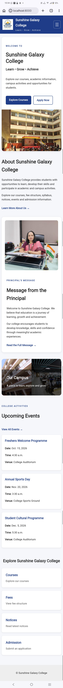About Page

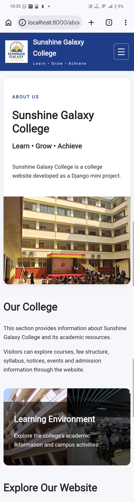Courses Page

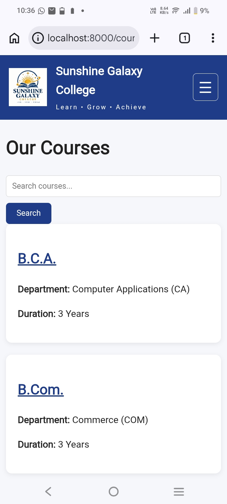Course Search

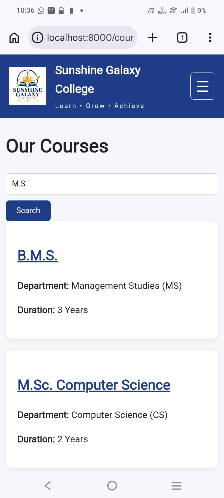Course Search Using URL Parameters

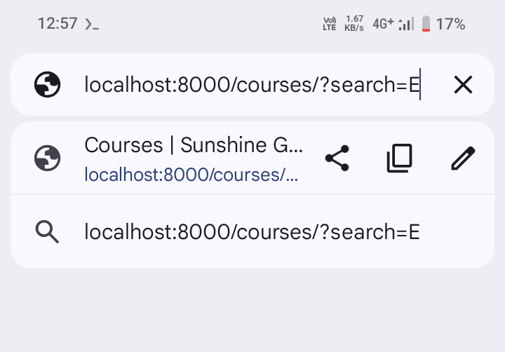Fee Structure

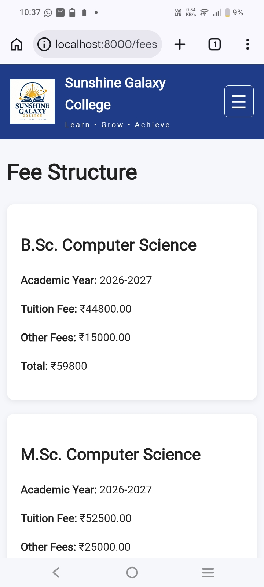Principal's Message

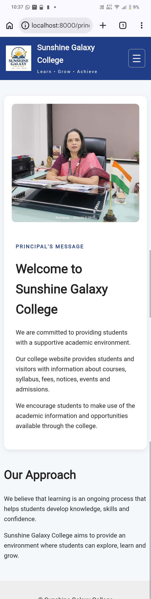Syllabus

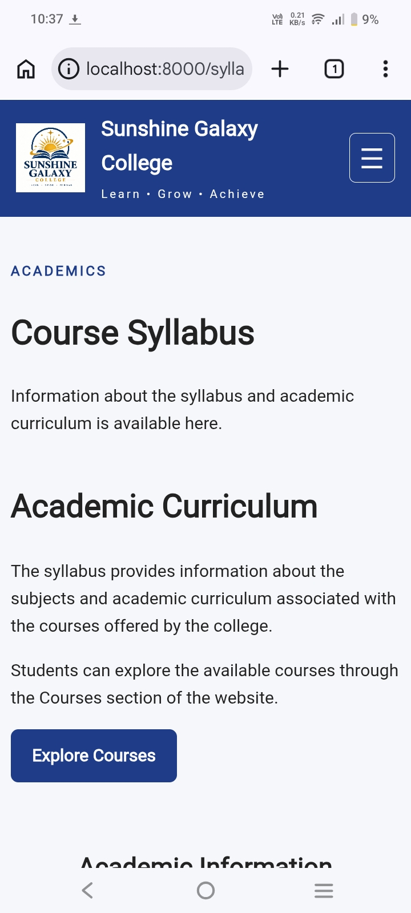Photo Gallery

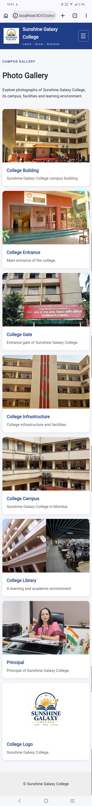11.2 Portal Application

Notices

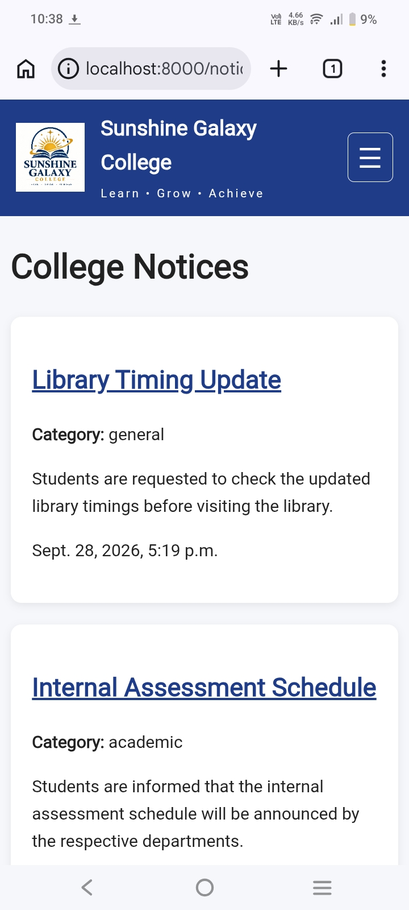Create Notice

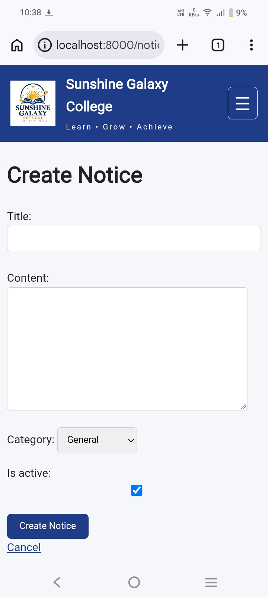Update Notice

Delete Notice

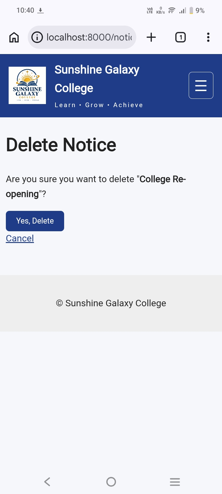Notice Not Found

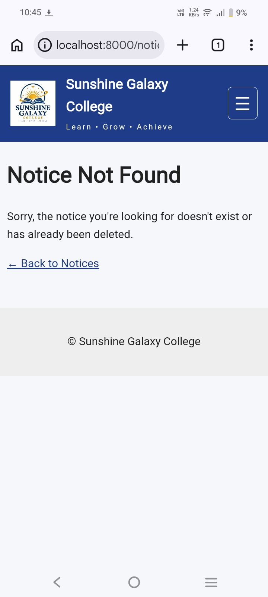Events

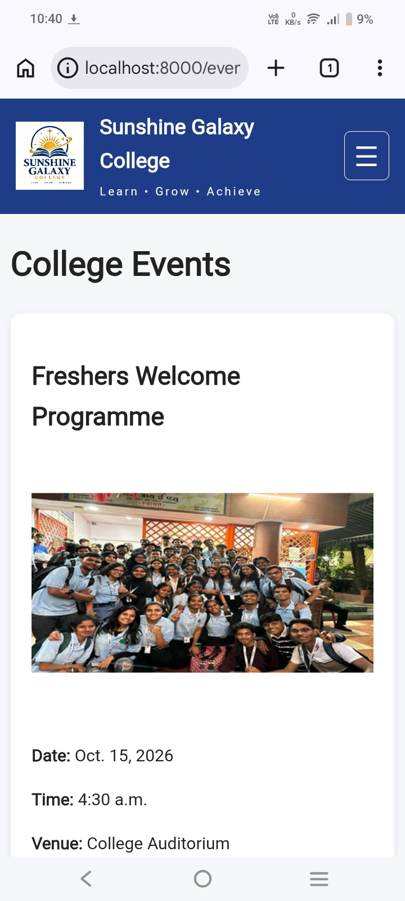Admission Form

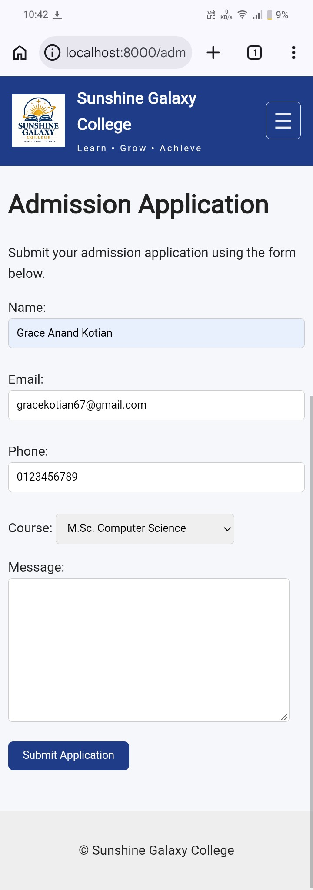Admission Successful

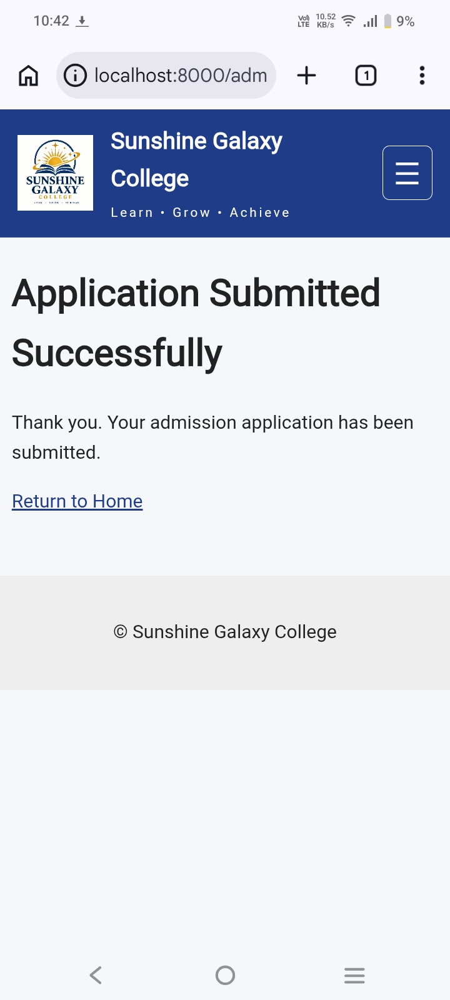Contact Page

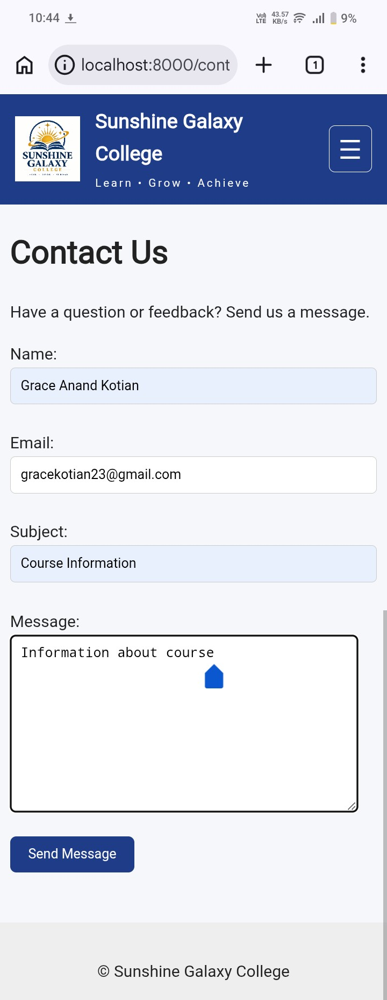Contact Form Successful

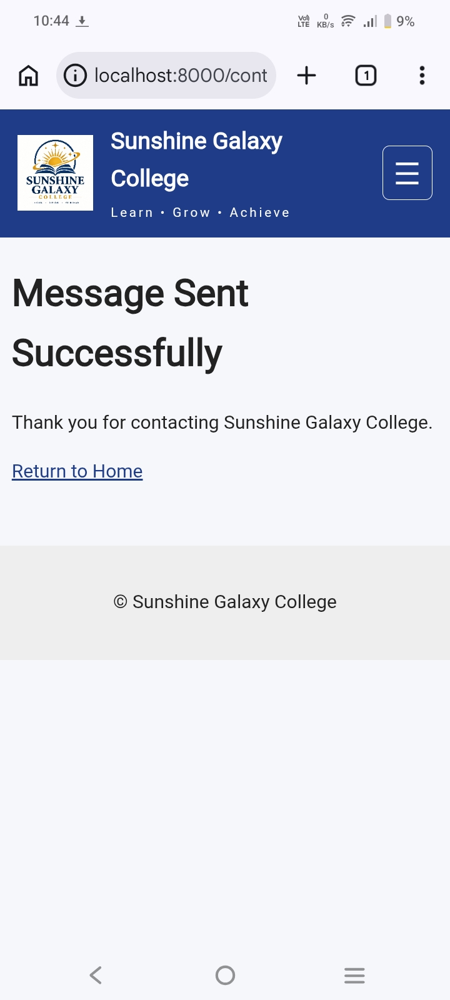11.3 Django Admin

Admin Login

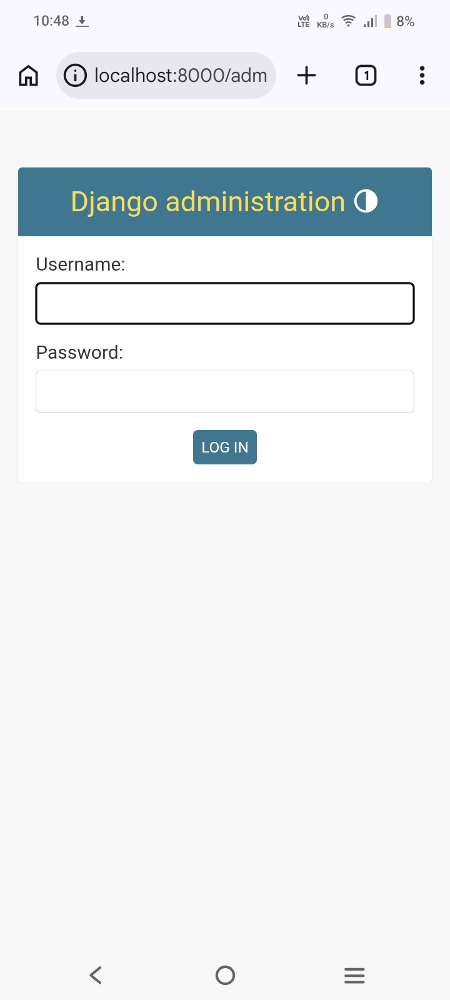Admin Dashboard

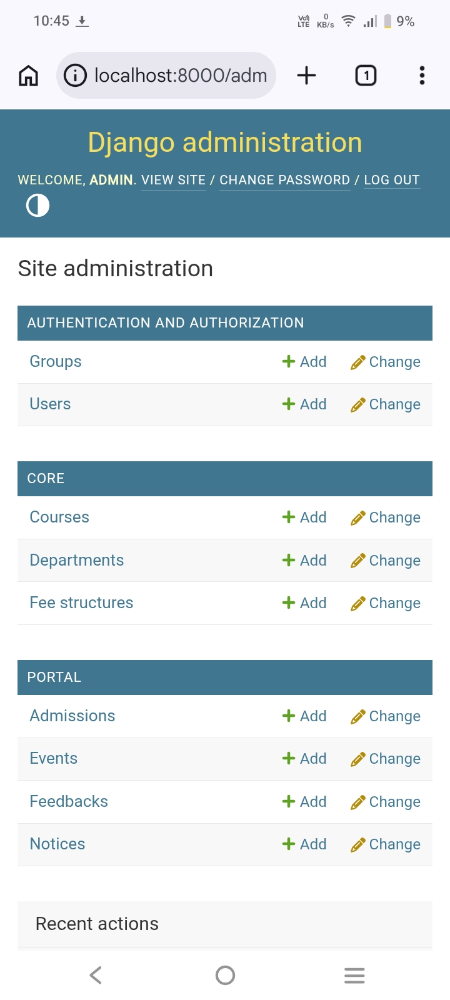Course Management

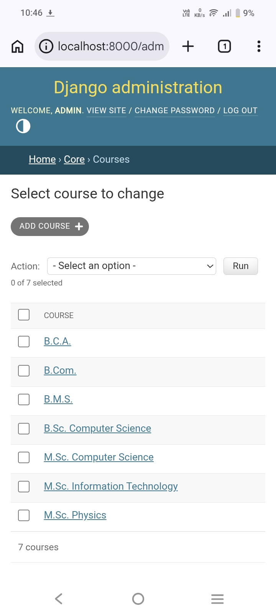Add Course

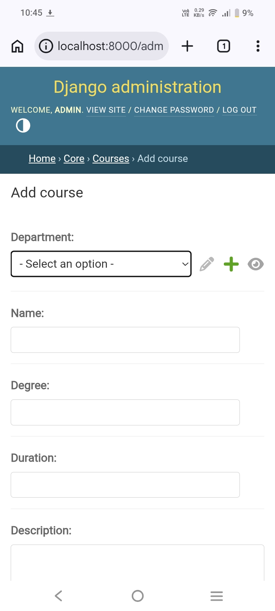

---

## 10. Django Concepts Demonstrated

### Django Project and Apps

The project uses a Django project named `mycollege` with two applications:

- `core`
- `portal`

### Models

Django models are used to represent college data in the database.

### Django ORM

The Django ORM is used to create, retrieve, update, and delete database records.

### Migrations

Database migrations were created and applied using:

```bash
python manage.py makemigrations
python manage.py migrate
```

### Django Admin

Django Admin is used to manage database records such as:

- Departments
- Courses
- Fees
- Events
- Notices
- Admissions
- Feedback

### Forms and ModelForms

Forms are used to collect and validate user input, including admission, feedback, and event-related data.

### Function-Based Views

Function-Based Views are used for handling various website requests and displaying pages.

### Class-Based Views

Class-Based Views are demonstrated for selected application functionality.

### URL Parameters

URL parameters are used to access specific objects or pages dynamically.

### Query Parameters

Query parameters are used for functionality such as searching and filtering data.

### Template Inheritance

A common `base.html` template is used so that other templates can reuse the common website layout.

Example:

```django

```

### Static Files

The project uses Django static files for:

- CSS
- JavaScript
- Images

### Media Files

Media handling is included for uploaded content such as event images.

---

## 11. Application Screenshots

Screenshots of the completed application are stored in:

```text
mycollege/screenshots/
```

The screenshots document the major pages and functionality of the completed project.

---

## 12. ER Diagram

The database relationships are represented by the ER diagram included with the project.

The core relationship is:

```text
Department 1 ───────< Course 1 ───────< FeeStructure
```

The ER diagram screenshots are stored in:

```text
mycollege/screenshots/
```

---

## 13. Installation and Running Instructions

### Step 1: Clone the Repository

```bash
gh repo clone Coderonaut08spacesci/SGCollege_Django SGCollege
```

Move into the repository:

```bash
cd SGCollege
```

### Step 2: Create a Virtual Environment

```bash
python -m venv venv
```

Activate the virtual environment.

#### Windows

```bash
venv\Scripts\activate
```

#### Linux / macOS / Termux

```bash
source venv/bin/activate
```

### Step 3: Install Dependencies

```bash
pip install -r requirements.txt
```

### Step 4: Move Into the Django Project Directory

```bash
cd mycollege
```

### Step 5: Apply Migrations

```bash
python manage.py migrate
```

### Step 6: Run the Development Server

```bash
python manage.py runserver
```

Open the website at:

```text
http://127.0.0.1:8000/
```

---

## 14. Django Admin

Create a superuser using:

```bash
python manage.py createsuperuser
```

Run the server:

```bash
python manage.py runserver
```

Open:

```text
http://127.0.0.1:8000/admin/
```

The Django Admin panel can be used to manage the college data stored in the database.

---

## 15. Requirements

The main dependency used by this project is:

```text
Django==6.1.1
```

The complete dependency list is available in:

```text
requirements.txt
```

---

## 16. Testing

The application was tested for major website functionality, including:

- Page navigation
- Course display
- Course search and filtering
- Fee information
- Admission form submission
- Notice display
- Event display
- Event-related functionality
- Contact page
- Photo gallery
- Static files
- Django Admin
- Database operations
- Form validation
- URL handling

The completed application was tested locally before being committed to GitHub.

---

## 17. Conclusion

The **Sunshine Galaxy College (S.G College)** project demonstrates how Django can be used to build a dynamic college website.

The project covers important Django concepts including models, ORM, migrations, forms, views, URLs, templates, static files, media files, Django Admin, and database relationships.

The project also provides practical experience in organizing a Django application, handling user input, connecting web pages with database data, and maintaining a project using Git and GitHub.

---

## 18. Author

**Sunshine Galaxy College (S.G College)**

Academic Mini Project

Developed using **Python Django**
